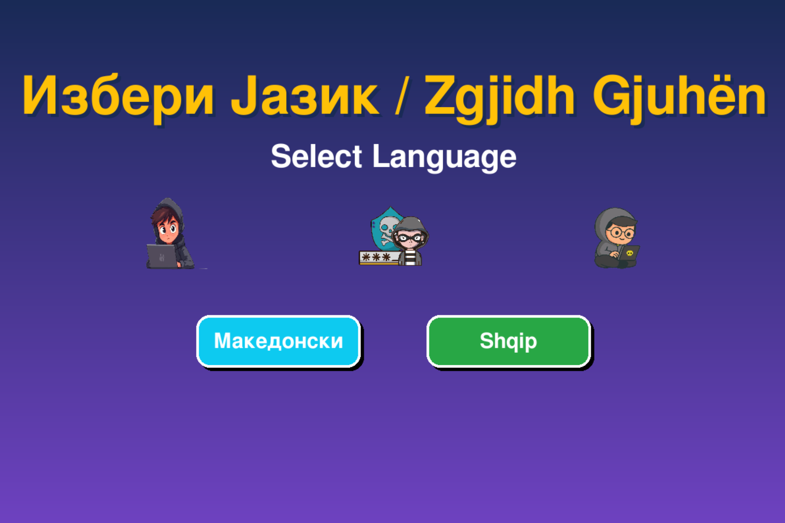
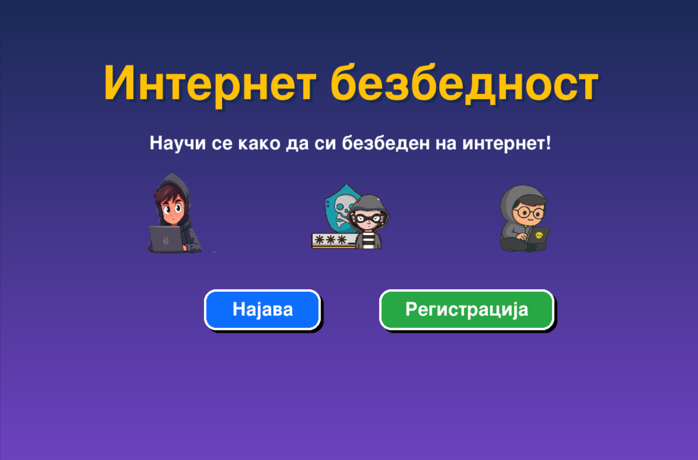
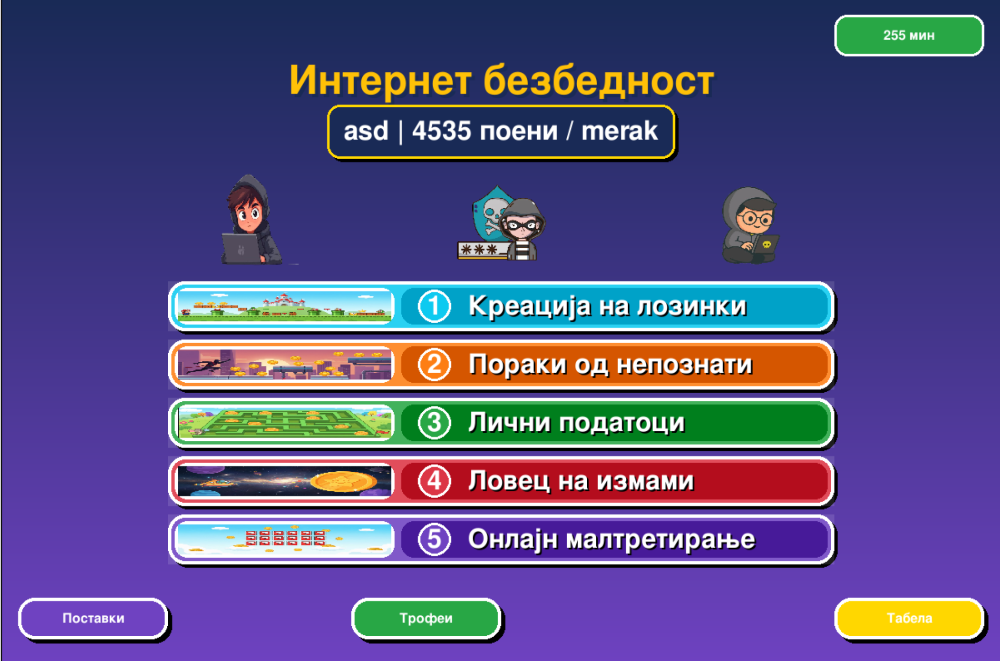
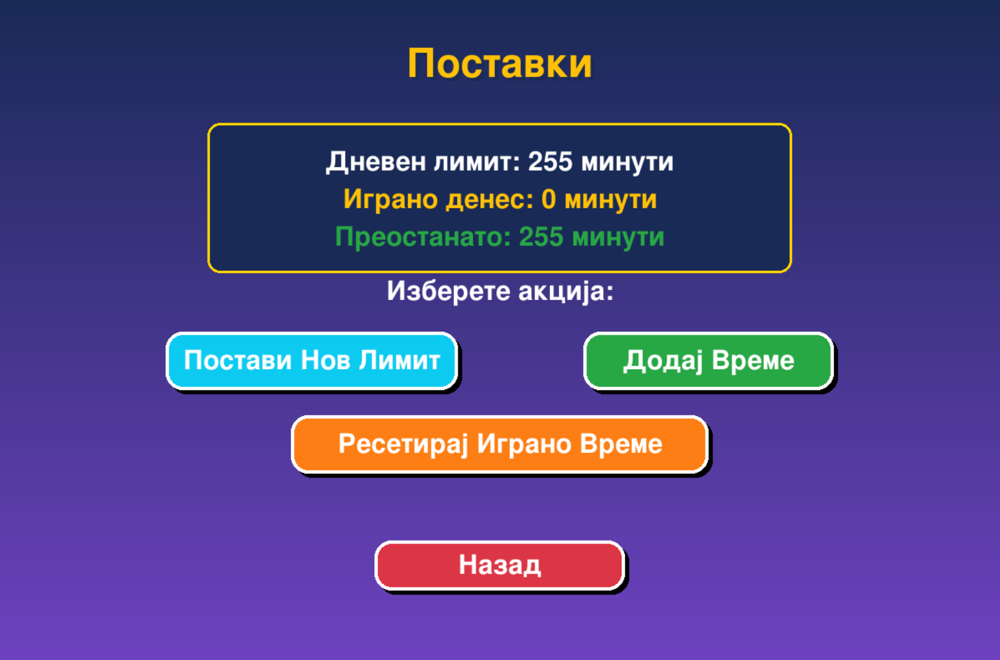
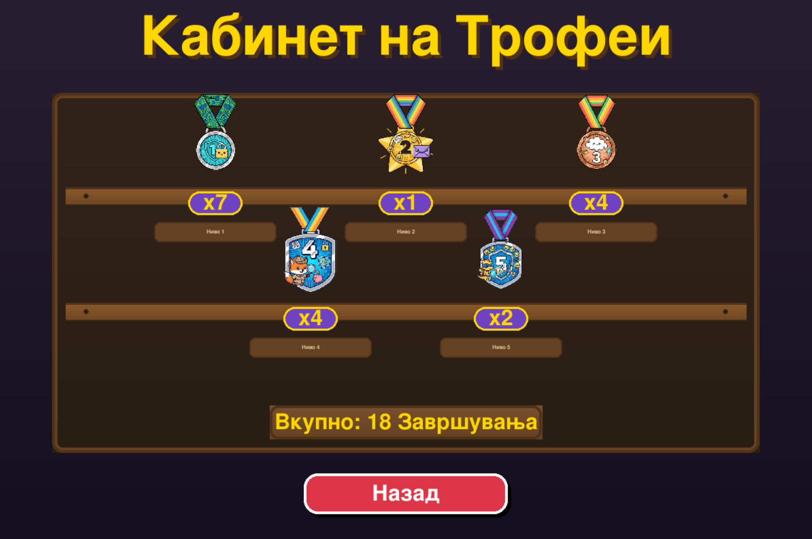
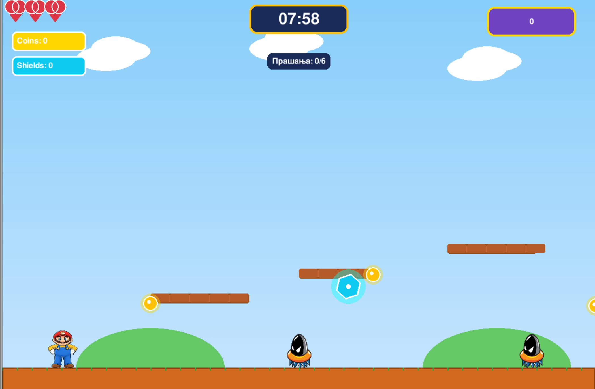
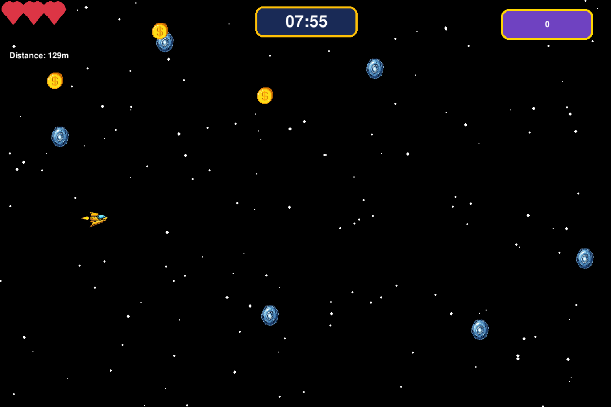
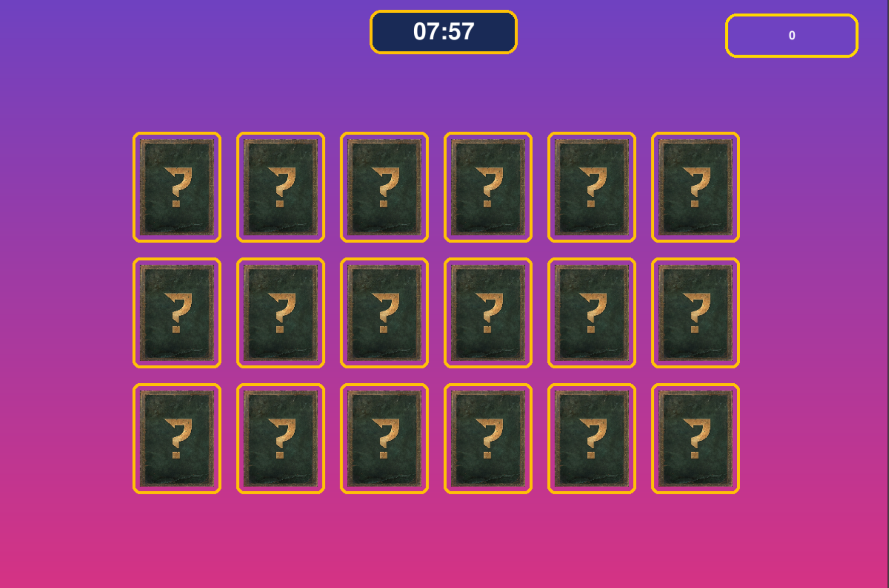

# 🛡️ Интернет безбедност – детска образовна игра
# 🛡️ Cyber Security – Educational Game for Kids

---

## 📖 Опис / Description

### 🇲🇰 Македонски
**„Интернет безбедност“** е детска образовна видео игра наменета за деца од **8 до 14 години**, која ги учи основните принципи на онлајн безбедност преку забавна игра во стилот на **Super Mario**.  
Играта комбинира **едукативни прашања**, **реални сценарија** и **интерактивни мини-игри** за да го направи учењето интересно, разбирливо и ефективно.

### 🇬🇧 English
**“Cyber Security”** is an educational video game for children aged **8–14**, designed to teach the fundamentals of online safety through fun **Super Mario–style gameplay**.  
The game combines **educational questions**, **real-life scenarios**, and **interactive mini-games** to make learning engaging, simple, and effective.

---

## 🎮 Како се игра / How to Play

### 🇲🇰 Македонски
- **Регистрација:** Родителот креира корисничка сметка за детето
- **Родителска контрола:** Поставување дневен временски лимит (15, 30, 45, 60, 90, 120 минути)
- **Играј и учи:** Детето поминува низ нивоа, собира поени и учи за интернет безбедност
- **Напредок:** Секое ниво содржи прашања и предизвици
- **Натпревар:** Табела со најдобри резултати (Leaderboard)

### 🇬🇧 English
- **Registration:** A parent creates a user account for the child
- **Parental Control:** Set a daily play-time limit (15, 30, 45, 60, 90, 120 minutes)
- **Play & Learn:** The child progresses through levels while learning online safety concepts
- **Progress:** Each level contains questions and challenges
- **Competition:** Leaderboard to track top scores

---

## 🧭 Контроли / Controls

### 🇲🇰 Македонски
- **W A S D** или **стрелки (← ↑ → ↓)** – Движење
- **SPACE** или **↑** – Скок
- **Глушец (Mouse)** – Избор на нивоа, менија и одговори

### 🇬🇧 English
- **W A S D** or **Arrow Keys (← ↑ → ↓)** – Movement
- **SPACE** or **↑** – Jump
- **Mouse** – Level selection, menus, and answers

---

## ✨ Карактеристики / Features

### 🇲🇰 Македонски
- 5 уникатни едукативни нивоа
- Систем за родителска контрола
- Следење на напредок и поени
- Едукативни прашања и сценарија
- Пријателски интерфејс за деца

### 🇬🇧 English
- 5 unique educational levels
- Parental control system
- Progress and scoring system
- Educational questions and scenarios
- Child-friendly user interface

---

## 🚀 Инсталација / Installation

### 🇲🇰 Македонски – Предуслови
```bash
Python 3.8 или понова верзија
Pygame библиотека
```

### 🇬🇧 English – Requirements
```bash
Python 3.8 or newer
Pygame library
```

### 🇲🇰 Македонски – Стартување
```bash
pip install pygame
python main.py
```

### 🇬🇧 English – Run the Game
```bash
pip install pygame
python main.py
```

---


---

## 🎓 Образовни Теми / Educational Topics

### 🇲🇰 Македонски
- Безбедни лозинки
- Лични податоци
- Пораки од непознати
- Интернет измами
- Кибер малтретирање

### 🇬🇧 English
- Secure passwords
- Personal data protection
- Messages from strangers
- Online scams
- Cyberbullying

---

---

## 📸 Слики од играта / Game Screenshots

### 🏁 Почетен екран / Starting Screen


---

### 🌍 Избор на јазик / Language Selection


---

### 🔐 Регистрација и Најава / Register & Login


---

### 🏠 Главно мени / Home Screen


---

### ⏱️ Поставки за време (Родителска контрола) / Time Settings (Parental Control)


---

### 🏆 Табела со резултати / Leaderboard


---

### 🥇 Кабинет со трофеи / Trophy Cabinet


---

### 🎮 Ниво 1 – Платформер / Level 1 – Platformer (Passwords)


---

### 🎮 Ниво 2 – Паркур / Level 2 – Parkour 


---


### 🧩 Ниво 3 – Лавиринт / Level 3 – Maze


---

### 🚀 Ниво 4 – Вселенски брод / Level 4 – Space Level


---

### 🧠 Ниво 5 – Меморија игра / Level 5 – Memory Game


## 👤 Автор / Author

### 🇲🇰 Македонски
**Filip Trajanovik**  
ФИНКИ – Проект по Програмирање на Видео Игри

### 🇬🇧 English
**Filip Trajanovik**  
FINKI – Video Game Programming Project

---

## 📝 Лиценца / License

### 🇲🇰 Македонски
Оваа игра е развиена за **образовни цели** и може слободно да се користи за едукација.

### 🇬🇧 English
This game is developed for **educational purposes** and may be freely used for learning and teaching.

---

